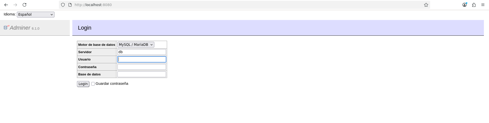
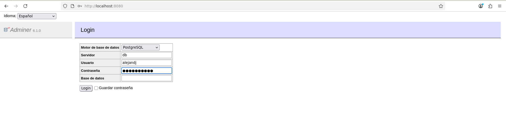
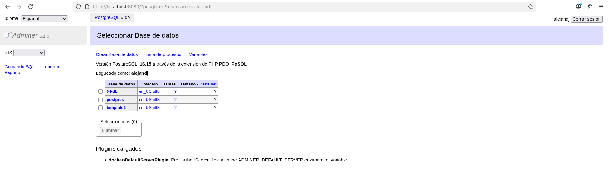

# 04 - Docker Network

## 🎯 Objetivo

Ejemplo en el que levantamos dos contenedores (una interfaz web con `Adminer` y una base de datos `PostgreSQL`) conectados mediante una red.

## 📁 Estructura

```
04-docker-network/
├── images/
│   ├── adminer-acceso.png
│   ├── adminer-credenciales.png
│   └── adminer-login.png
├── docker-compose.yml
└── README.md
```

## 📄 docker-compose.yml

```yaml
services:
  # Servicio 1: Base de datos PostgreSQL
  db:
    image: postgres:16-alpine
    environment:
      POSTGRES_USER: alejandj
      POSTGRES_PASSWORD: secreto123
      POSTGRES_DB: appdb
    volumes:
      - db-data:/var/lib/postgresql/data

  # Servicio 2: Interfaz web para gestionar la base de datos (Adminer)
  adminer:
    image: adminer
    ports:
      - "8080:8080"
    depends_on:          # Espera a que el contenedor 'db' se inicie antes de arrancar Adminer
      - db

volumes:
  db-data:
```

## 🧠 Qué aprendemos

- Cómo orquestar **múltiples contenedores** simultáneamente usando `docker-compose` (en este caso, una base de datos y un panel de administración web).
- Cómo configurar servicios (como `PostgreSQL`) utilizando `environment` para definir sus variables de entorno necesarias.
- Qué función cumple `depends_on`: establece orden de arranque entre servicios.
- Qué es una **red** de Docker: permite conectar dos o varios contenedores entre sí para que puedan comunicarse de forma aislada y segura.
- La importancia de la **persistencia** mediante volúmenes (`volumes`) para que los datos de la base de datos no se pierdan al apagar los contenedores.

## 🚀 Cómo probar este ejercicio

1. **Levantar los contenedores**

    ```bash
    docker compose up
    ```

2. **Probarlo**

    Abre **`http://localhost:8080`** en tu navegador para ver la interfaz gráfica de Adminer y conectarte a la base de datos con tus credenciales.

## 📤 Salida

**Terminal:**

```text
Attaching to adminer-1, db-1
db-1  | 
db-1  | PostgreSQL Database directory appears to contain a database; Skipping initialization
db-1  | 
db-1  | 2026-09-24 15:31:11.351 UTC [1] LOG:  starting PostgreSQL 16.15 on x86_64-pc-linux-musl, compiled by gcc (Alpine 15.2.0) 15.2.0, 64-bit
db-1  | 2026-09-24 15:31:11.351 UTC [1] LOG:  listening on IPv4 address "0.0.0.0", port 5432
db-1  | 2026-09-24 15:31:11.351 UTC [1] LOG:  listening on IPv6 address "::", port 5432
db-1  | 2026-09-24 15:31:11.359 UTC [1] LOG:  listening on Unix socket "/var/run/postgresql/.s.PGSQL.5432"
db-1  | 2026-09-24 15:31:11.377 UTC [27] LOG:  database system was shut down at 2026-09-24 15:31:04 UTC
db-1  | 2026-09-24 15:31:11.391 UTC [1] LOG:  database system is ready to accept connections
adminer-1  | [Thu Sep 24 15:31:11 2026] PHP 8.4.25 Development Server (http://[::]:8080) started

```

**Navegador:**

1. Al acceder a `http://localhost:8080` veremos la siguiente interfaz:



2. Introducimos las credenciales puestas en `environment`:



3. Acceso exitoso a la base de datos:


